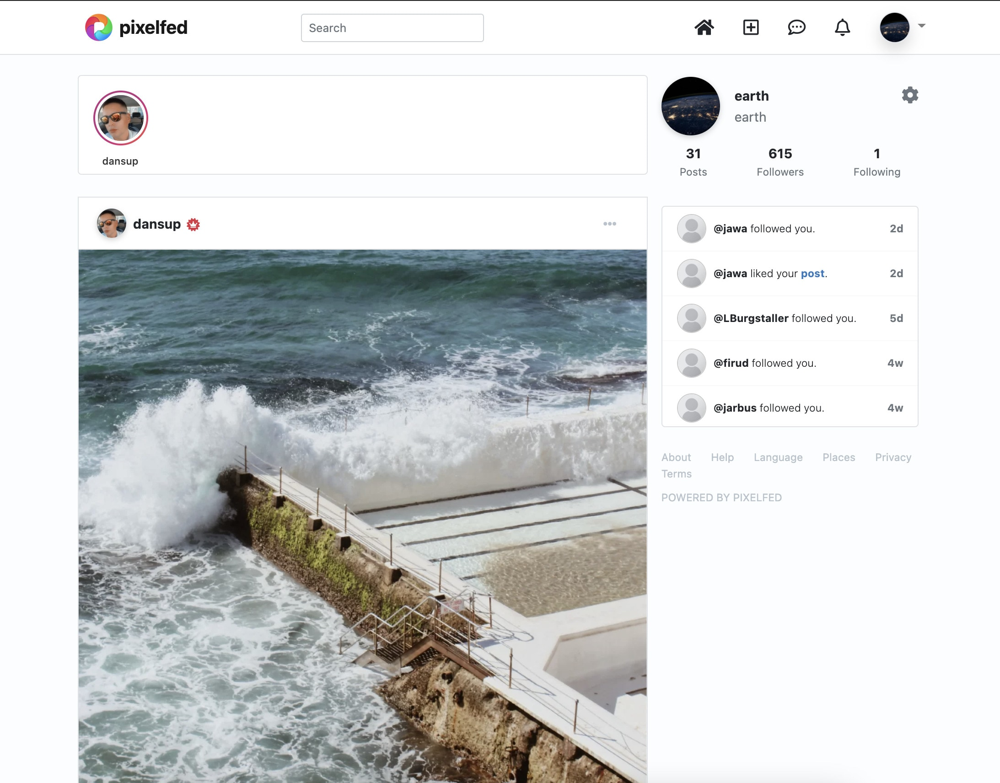

# Pixelfed CI/CD pipeline

Deploy Pixelfed server with CI/CD on Elestio

 
 

# Once deployed ...

You can can open Pixelfed UI here:

    URL: https://[CI_CD_DOMAIN]
    email: [ADMIN_EMAIL]
    password: [ADMIN_PASSWORD]

You can open PHPMyAdmin web UI here:

    URL: https://[CI_CD_DOMAIN]:2443
    email: root
    password: [ADMIN_PASSWORD]

# Custom domain instructions (IMPORTANT)

By default we setup a CNAME on elestio.app domain, but probably you will want to have your own domain.

**_Step1:_** add your domain in Elestio dashboard as explained here:

    https://docs.elest.io/books/security/page/custom-domain-and-automated-encryption-ssltls

**_Step2:_** update the env vars to indicate your custom domain
Open Elestio dashboard > Service overview > click on UPDATE CONFIG button > Env tab
there update `APP_URL`, `APP_DOMAIN`, `ADMIN_DOMAIN` & `SESSION_DOMAIN` with your real domain

**_Step3:_** you must reset the Pixelfed instance DB, you can do that with those commands, connect over SSH and run this:

    cd /opt/app;
    docker-compose down;
    rm -rf ./storage;
    ./scripts/preInstall.sh
    docker-compose up -d
    ./scripts/postInstall.sh

You will start over with a fresh instance of Pixelfed directly configured with the correct custom domain name and federation will work as expected
